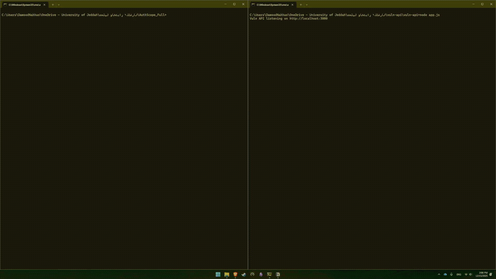

# AuthScope — CTF/JWT/Cookie Enumerator (Passive)

AuthScope is a small, original helper tool for **CTFs**, **web labs**, and **authorized security testing**.
It performs **passive analysis only** (no forging / no active exploitation).

## Features
- Enumerate all cookies sent by the server.
- Identify missing cookie security flags: HttpOnly, Secure, SameSite.
- Detect JWT tokens from cookies, response headers, and HTML body.
- Decode JWT headers & payload.
- Highlight common CTF-relevant issues such as:
  - alg: none
  - expired tokens
  - missing kid, iss, aud
- Export nuclei-compatible CSV.

## Installation
```
pip install requests
# or
pip install -r requirements.txt
```

## Usage
```
python authscope.py \
  --url http://localhost:3000/admin/data \
  --auth-login http://localhost:3000/auth/login \
  --username alice \
  --password alice123 \
  --unsigned \
  --auto-exploit

# or

python authscope.py \
  --url http://localhost:3000/admin/data \
  --auth-login http://localhost:3000/auth/login \
  --username alice \
  --password alice123 \
  --unsigned \
  --auto-exploit \
  --export output.csv
```


## Legal & Ethical Notice
Use only in:
- CTFs
- labs
- authorized testing

Never on production without permission.
